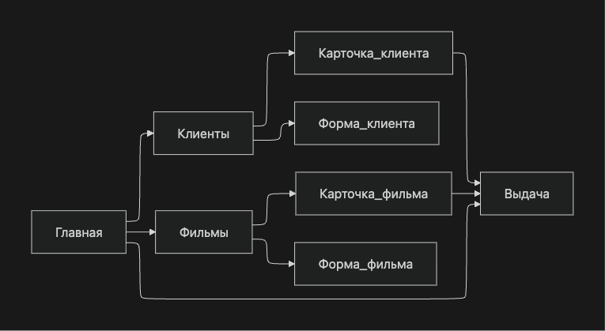
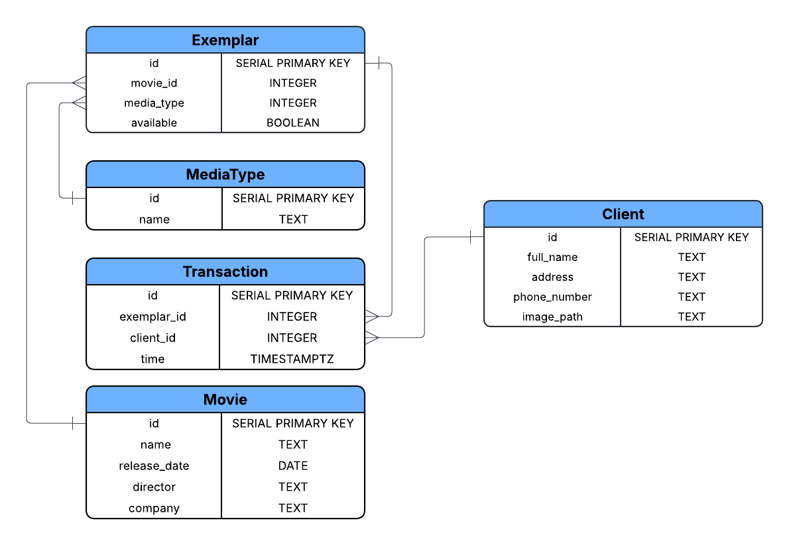

# Видеопрокат: use cases и описание страниц

## 1. Схема навигации
С каждой страницы можно попасть на главную

## 2. Перечень сценариев использования

| Сценарий | Результат |
|---|---|
| Просмотр списка клиентов | Пользователь видит всех клиентов и может перейти к карточке клиента |
| Просмотр подробной информации о клиенте | Пользователь видит информацию о клиенте и выданных ему экземлярах носителей |
| Добавление клиента | Создана новая карточка клиента с контактными данными |
| Редактирование/удаление клиента | Данные клиента обновлены или клиент удален (если нет активных выдач) |
| Просмотр списка фильмов | Пользователь видит каталог фильмов и основные сведения о наличии |
| Просмотр подробной информации о фильме | Пользователь видит подробные сведения о фильме, его тарифах и экземплярах |
| Добавление/редактирование/удаление фильма | Карточка фильма и его справочные данные изменены |
| Управление экземплярами фильма | Добавлены/удалены физические экземпляры, обновлен их статус |
| Выдача экземпляра клиенту | Создана запись выдачи, экземпляр отмечен как выданный |
| Прием экземпляра | Зафиксирован возврат, экземпляр снова свободен |
| Просмотр истории клиента и текущих выдач | Отображается история выдач/возвратов клиента и список невозвращенных носителей |
| Просмотр истории экземпляров фильма и сводного отчета за период | Получена аналитика по выдачам/возвратам/наличию за выбранный интервал |

## 3. Пошаговое описание сценариев

### Просмотр списка клиентов
1. Пользователь открывает страницу "Клиенты", нажав кнопку на главной странице.
2. Система загружает список клиентов (ФИО, телефон, число активных выдач).
3. Пользователь может использовать поиск/фильтры.

### Просмотр подробной информации о клиенте
1. Пользователь кликает на клиента в списке (см. предыдущий пункт).
2. Система загружает личную карточку клиента видеопроката.
3. Карточка содержит ФИО, контактные данные и фотографию клиента.
4. Страница содержит поле невозвращенных экземпляров с кнопкой "Принять возврат".
5. Страница также содержит поле истории приема и выдачи, поле может быть отфильтровано по интервалу времени.

### Добавление клиента
1. На странице "Клиенты" пользователь нажимает "Добавить клиента".
2. Открывается форма клиента.
3. Пользователь вводит ФИО, контактные данные (адрес, телефон) и загружает фотографию.
4. Нажимает "Сохранить".
5. Система валидирует данные и создает запись.

### Редактирование/удаление клиента
1. Пользователь открывает карточку клиента.
2. Нажимает "Редактировать" или "Удалить".
3. При редактировании вносит изменения и сохраняет.
4. Система валидирует обновленные данные
5. При удалении подтверждает действие.
6. Система запрещает удаление, если у клиента есть невозвращенные экземпляры.

### Просмотр списка фильмов
1. Пользователь открывает страницу "Фильмы".
2. Система отображает каталог (название, год, режиссер, компания, наличие).
3. Пользователь может использовать поиск/фильтры по названию, году, режиссеру.

### Просмотр подробной информации о фильме
1. Пользователь кликает на фильм в списке (см. предыдущий пункт).
2. Система загружает карточку фильма.
3. Карточка содержит название фильма, год выхода, режиссера, компанию, описание, логотип.
4. В карточке отображены тарифы проката по каждому из типу носителя, количество всех и свободных экземпляров по каждому типу носителя.
5. Карточка содержит список физических экземпляров фильма с их статусами (свободен/выдан) и кнопкой добавить экземпляр.
6. Карточка также содержит историю выдачи и возврата экземпляров фильма, которая может быть отфильтрована по интервалу времени, а также по конкретному экземлпяру.

### Добавление/редактирование/удаление фильма
1. Пользователь выбирает "Добавить фильм" или открывает существующий фильм.
2. В форме указывает название, компанию, режиссера, год.
3. Для каждого типа носителя задает стоимость проката.
4. Сохраняет изменения.
5. При удалении фильма система требует отсутствия активных выдач его экземпляров.

### Управление экземплярами фильма
1. Пользователь открывает карточку фильма.
2. В разделе "Экземпляры" добавляет новые экземпляры (инвентарный номер, тип носителя, статус).
3. Может удалить экземпляр, если он не выдан.
4. Система обновляет сводные показатели "всего" и "свободно" по типам носителей.

### Выдача экземпляра клиенту
1. Пользователь открывает страницу "Выдача" (можно перейти из карточки фильма/клиента, нажав на кнопку, тогда форма автоматически заполнит нужное поле).
2. Выбирает клиента, фильм и тип носителя.
3. Система предлагает свободный экземпляр и тариф.
4. Пользователь подтверждает выдачу.
5. Система создает запись выдачи с датой и ценой, статус экземпляра меняется на "выдан".

### Прием экземпляра
1. Пользователь открывает страницу "Клиенты"
2. Пользователь фильтрует клиентов и находит нужного
3. Пользователь переход на личную страницу клиента
4. Напротив нужного экземпляра пользователь нажимает кнопку "Принять возврат"

### Просмотр истории клиента и текущих выдач
1. Пользователь открывает карточку клиента.
2. Система показывает блок "Сейчас на руках" и "История операций".
3. Пользователь фильтрует операции по периоду/статусу.
4. При необходимости переходит в карточку фильма из истории.

## 4. Перечень страниц и их назначение

| Страница | Назначение |
|---|---|
| Главная (Dashboard) | Быстрый вход в разделы и краткая статистика |
| Клиенты (список) | Поиск, просмотр, добавление клиентов |
| Карточка клиента | Просмотр/редактирование данных, история и текущие выдачи |
| Форма клиента | Создание/редактирование данных клиента |
| Фильмы (список) | Поиск, просмотр, добавление фильмов |
| Карточка фильма | Детали фильма, тарифы, экземпляры, история экземпляров |
| Форма фильма | Создание/редактирование данных фильма и тарифов |
| Выдача | Выдача экземпляра клиенту |

## 5. Модель содержимого страниц

### Главная
- Переход в "Клиенты", "Фильмы", "Выдача", "Прием и оплата", "Отчеты".

### Клиенты (список)
Данные:
- Таблица: ФИО, контактные данные, число активных выдач.
- Фильтры: строка поиска по ФИО/телефону.
Действия:
- Открыть карточку клиента.
- Добавить клиента.

### Карточка клиента
Данные:
- ФИО, адрес, телефон, фотография.
- Список "Сейчас на руках": фильм, носитель, дата выдачи, цена.
- История операций: выдача, возврат, оплата.
Действия:
- Редактировать клиента.
- Удалить клиента.
- Перейти к выдаче нового фильма клиенту, прием возврата.

### Форма клиента
Данные:
- Поля ввода: ФИО, контактные данные, фотография.
Действия:
- Сохранить.
- Отменить.

### Фильмы
Данные:
- Таблица: название, год, режиссер, компания.
- Сводка наличия: всего/свободно по типам носителей.
- Поиск/фильтры по названию, году, режиссеру.
Действия:
- Открыть карточку фильма.
- Добавить фильм.

### Карточка фильма
Данные:
- Название, год, режиссер, компания.
- Тарифы по носителям (кассета/диск).
- Список экземпляров: инвентарный номер, тип носителя, статус.
- История экземпляров: кто и когда брал/возвращал.
Действия:
- Редактировать фильм.
- Удалить фильм.
- Добавить экземпляр.
- Удалить экземпляр (если не выдан).
- Перейти к выдаче.
- Отфильтровать нужный экземпляр

### Форма фильма
Данные:
- Поля: название, год, компания, режиссер.
- Поля тарифов по типам носителей.
Действия:
- Сохранить.
- Отменить.

### Выдача
Данные:
- Выбор клиента.
- Выбор фильма и типа носителя.
- Автоподбор свободного экземпляра.
- Стоимость проката.
Действия:
- Подтвердить выдачу.
- Отменить.

## 6. Схема базы данных

